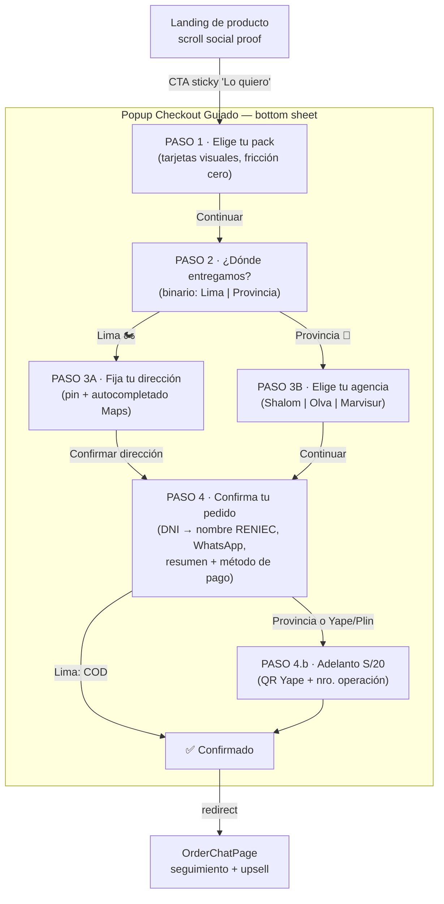

# 04 · CHECKOUT UX FLOW — Diseño del flujo de compra (Progressive Disclosure)

> **Rol del documento:** especificación de UI/UX + CRO para el popup de checkout guiado
> que consume `src/lib/checkout-flow.ts`. Diseñado bajo el principio de **menor a mayor
> resistencia**: primero decisiones viscerales de un toque, al final los datos "caros"
> (DNI, teléfono, pago).
>
> **Benchmark de referencia:** McDonald's App (selector visual de producto), Rappi
> (checkout por pasos con CTA dominante), Uber Eats (dirección con autocompletado).

---

## 0. Principios de diseño (reglas duras)

| Regla | Aplicación |
|---|---|
| **One Screen, One Task** | Cada pantalla pide UNA decisión o UN dato. Nunca dos preguntas en la misma vista. |
| **CTA dominante** | El botón "Siguiente" es el elemento con mayor peso visual: full-width, alto ≥ 52px, color primario de marca, anclado al fondo (thumb zone). |
| **Barra de progreso discreta** | Dots o barra fina bajo el header: "Paso N de 4". Nunca porcentajes ni pasos con nombre técnico. |
| **Fricción creciente** | Toque → toque → autocompletado → escritura. El usuario ya invirtió 3 pasos cuando llega al DNI (sunk cost = menos abandono). |
| **Sin dead-ends** | Todo paso tiene "← Atrás" (texto, peso visual mínimo). Cerrar el popup NO borra el estado (el reducer vive en memoria). |
| **Cero registro** | Nunca pedir contraseña ni crear cuenta. El DNI + WhatsApp *son* la identidad (RENIEC autocompleta el nombre). |

---

## 1. Mapa del Flujo de Usuario (User Flow)



**Bifurcación clave (ya soportada por el reducer):**

- **Lima** → `MOTORIZADO_LIMA` → pago contraentrega (`CONTRAENTREGA`) → 4 pantallas, cero pago online. Es el camino de conversión máxima.
- **Provincia** → `AGENCIA_PROVINCIA` → fuerza `YAPE_PLIN` + paso de adelanto de flete (`DEFAULT_ADVANCE_PEN = S/20`) → 5 pantallas.

**Nota de implementación (orden de pasos):** el reducer actual ordena
`contacto → entrega → pago`. Esta spec invierte a **`pack → entrega → contacto+pago`**
(identificación al final = menor resistencia inicial). El cambio es pequeño: ajustar
`stepsFor()` y `canAdvance()` en `checkout-flow.ts`; las acciones (`SET_PACK`,
`SET_DELIVERY_TYPE`, `SET_PIN`, `SET_DNI`, …) ya existen y no cambian.

---

## 2. Wireframes descriptivos por pantalla

Convenciones: contenedor = **bottom sheet** (mobile-first, ~92% viewport, esquinas
superiores redondeadas 24px, handle de arrastre). Desktop: modal centrado 420px.
Tipografía y tokens: los ya usados en `LandingProductoPage.tsx` (Tailwind).

### PASO 1 · Selección visceral del producto — fricción cero

```
┌─────────────────────────────────────┐
│ ━━                                  │ ← handle drag + X (cerrar, esq. sup. der.)
│ ●○○○  Paso 1 de 4                   │ ← progreso discreto (dots)
│                                     │
│  Elige tu pack 🎁                   │ ← H1, font-black, 22px
│  Mientras más llevas, más ahorras   │ ← subtítulo gris, 13px
│                                     │
│ ┌───────────────┐ ┌───────────────┐ │
│ │ [FOTO HD 1:1] │ │ [FOTO HD 1:1] │ │ ← tarjetas 2 col, radio 16px
│ │               │ │ ⭐ MÁS VENDIDO │ │ ← badge dorado solo en el pack "ancla"
│ │ 1 Masajeador  │ │ Pack Pareja   │ │ ← nombre, font-bold
│ │               │ │               │ │
│ │ S/ 79         │ │ S/ 139        │ │ ← precio font-black 20px
│ │ envío gratis  │ │ Ahorras S/19  │ │ ← value prop en verde
│ │      (○)      │ │      (●)      │ │ ← radio; seleccionado = borde 2px
│ └───────────────┘ └───────────────┘ │   color primario + fondo tinte 5%
│                                     │
│ ┌─────────────────────────────────┐ │
│ │      Continuar  →               │ │ ← CTA full-width, 52px, primario
│ └─────────────────────────────────┘ │
│   🔒 Pago al recibir disponible     │ ← trust line, 11px gris
└─────────────────────────────────────┘
```

- **Pre-selección:** el pack de mejor valor llega ya marcado (hoy la landing pre-selecciona
  el último pack — mantener). El usuario puede *no tocar nada* y solo pulsar Continuar.
- Con 3 packs: las 2 tarjetas principales en grilla + el tercero como fila compacta
  debajo ("Pack Familia x3 · S/195 · Ahorras S/42"). Nunca más de 3 opciones (paradoja
  de la elección).
- Tap en tarjeta = seleccionar, NO avanzar (evita avances accidentales). Avanza solo el CTA.
- Acción reducer: `SET_PACK` → `NEXT`.

### PASO 2 · Contexto logístico — fricción muy baja (binario, un toque)

```
┌─────────────────────────────────────┐
│ ← Atrás        ○●○○  Paso 2 de 4    │
│                                     │
│  ¿Dónde entregamos tu pedido? 📦    │
│                                     │
│ ┌─────────────────────────────────┐ │
│ │ 🏍️  Lima Metropolitana          │ │ ← tarjeta-botón full-width, 72px
│ │     Llega en 24-48 h            │ │
│ │     Pagas al recibir 🤝         │ │ ← beneficio = quita miedo
│ └─────────────────────────────────┘ │
│ ┌─────────────────────────────────┐ │
│ │ 🚚  Provincia                   │ │
│ │     Envío por agencia (2-5 días)│ │
│ │     Shalom · Olva · Marvisur    │ │
│ └─────────────────────────────────┘ │
│                                     │
│         (sin CTA inferior)          │
└─────────────────────────────────────┘
```

- **Excepción deliberada a "CTA abajo":** aquí el tap en la tarjeta ES el avance
  (patrón quiz — igual que los selectores de Rappi). Cero campos, cero botón extra.
- La tarjeta Lima va primero y anuncia COD: el beneficio "pagas al recibir" es el
  desbloqueador de confianza n.º 1 en e-commerce peruano.
- Acción reducer: `SET_DELIVERY_TYPE` (setea además `paymentMethod` y `paymentStatus`
  automáticamente) → `NEXT`.

### PASO 3A · Detalle de entrega LIMA — fricción media

```
┌─────────────────────────────────────┐
│ ← Atrás        ○○●○  Paso 3 de 4    │
│                                     │
│  ¿A dónde llevamos tu pedido? 📍    │
│                                     │
│ ┌─────────────────────────────────┐ │
│ │ 🔍 Escribe tu dirección…        │ │ ← input con autocompletado
│ └─────────────────────────────────┘ │   (Google Places, sesión token)
│ ┌─────────────────────────────────┐ │
│ │        [ MAPA con PIN 📍 ]      │ │ ← mapa 180px; pin arrastrable
│ │     "Arrastra el pin si hace    │ │   para ajuste fino
│ │      falta ajustar"             │ │
│ └─────────────────────────────────┘ │
│ ┌─────────────────────────────────┐ │
│ │ Piso / dpto / referencia        │ │ ← UN solo campo opcional
│ │ (opcional)                      │ │   placeholder: "Ej: Dpto 302,
│ └─────────────────────────────────┘ │   portón negro"
│ ┌─────────────────────────────────┐ │
│ │     Confirmar dirección  →      │ │ ← CTA; deshabilitado hasta
│ └─────────────────────────────────┘ │   tener pin (lat/lng)
└─────────────────────────────────────┘
```

- Al abrir, pedir geolocalización del navegador con soft-prompt propio antes del prompt
  nativo ("📍 Usa mi ubicación actual" como chip sobre el input). Si acepta: pin puesto,
  dirección reverse-geocodificada, el usuario solo confirma. **Mejor caso: 2 taps.**
- Departamento + referencia colapsados en UN campo opcional (no 3 inputs).
- Acciones reducer: `SET_PIN` (+ `addressText`), `SET_REFERENCE` → `NEXT`.

### PASO 3B · Detalle de entrega PROVINCIA — fricción media

```
┌─────────────────────────────────────┐
│ ← Atrás        ○○●○  Paso 3 de 4    │
│                                     │
│  ¿Por qué agencia lo recoges? 🚚    │
│  Enviamos a todo el Perú            │
│                                     │
│ ┌──────────┐┌──────────┐┌─────────┐ │
│ │ [logo]   ││ [logo]   ││ [logo]  │ │ ← chips-tarjeta seleccionables
│ │ Shalom   ││ Olva     ││ Marvisur│ │
│ └──────────┘└──────────┘└─────────┘ │
│ ┌─────────────────────────────────┐ │
│ │ Ciudad / sede de recojo         │ │ ← autocompletado sobre
│ └─────────────────────────────────┘ │   src/data/peru-geo.ts
│                                     │
│ ┌─────────────────────────────────┐ │
│ │        Continuar  →             │ │
│ └─────────────────────────────────┘ │
│  ℹ️ Solo adelantas S/20 del envío;   │ ← anticipa el adelanto AQUÍ
│    el resto lo pagas al recoger     │   (sin sorpresas en el paso 4)
└─────────────────────────────────────┘
```

- **Regla CRO anti-sorpresa:** el adelanto de S/20 se anuncia un paso ANTES de cobrarse.
  El abandono por "pago sorpresa" es el asesino n.º 1 de checkouts de provincia.
- Acción reducer: `SET_AGENCY` → `NEXT`.

### PASO 4 · Identificación y pago — fricción alta (final)

```
┌─────────────────────────────────────┐
│ ← Atrás        ○○○●  Paso 4 de 4    │
│                                     │
│  Último paso, {nombre|👋}           │ ← si RENIEC ya resolvió, personaliza
│                                     │
│ ┌─────────────────────────────────┐ │
│ │ 🪪 DNI (8 dígitos)              │ │ ← inputmode=numeric, maxlength 8
│ └─────────────────────────────────┘ │
│   ✓ María Fernanda Quispe R.        │ ← nombre RENIEC en verde al validar
│                                     │   (efecto "magia": confianza + 0 campos
│ ┌─────────────────────────────────┐ │    de nombre/apellido)
│ │ 📱 WhatsApp (9 dígitos)         │ │ ← inputmode=tel; "te avisamos por aquí"
│ └─────────────────────────────────┘ │
│ ┌─ Tu pedido ─────────────────────┐ │
│ │ Pack Pareja ⭐ ×1        S/ 139 │ │ ← resumen SIEMPRE visible, compacto
│ │ Envío Lima               GRATIS │ │
│ │ Total                    S/ 139 │ │ ← total font-black
│ └─────────────────────────────────┘ │
│  ¿Cómo pagas?                       │
│  (●) 🤝 Al recibir (efectivo/Yape) │ ← Lima: COD pre-seleccionado
│  (○) 💜 Yape/Plin ahora            │ ← provincia: Yape/Plin fijo
│  (○) 💳 Tarjeta          [Pronto]  │ ← visible pero disabled (roadmap)
│                                     │
│ ┌─────────────────────────────────┐ │
│ │   Confirmar pedido · S/ 139  ✓  │ │ ← CTA con el monto DENTRO del botón
│ └─────────────────────────────────┘ │
│  🔒 Tus datos solo se usan para     │
│    la entrega y tu boleta           │
└─────────────────────────────────────┘
```

- **DNI primero, con recompensa inmediata:** al 8.º dígito se dispara `dni-lookup`
  (Decolecta/RENIEC) y aparece el nombre en verde. Esto reemplaza 2-3 campos (nombres,
  apellidos) y explica POR QUÉ pedimos el DNI. RUC (11 díg.) para factura: enlace
  discreto "¿Necesitas factura? Ingresa tu RUC".
- Email **no se pide** en el MVP (WhatsApp es el canal real de la operación). Cada campo
  extra ≈ −4-8% de conversión.
- El CTA lleva el monto: elimina la última duda ("¿cuánto era?") en el momento del clic.
- Validación en vivo (`canAdvance`): CTA deshabilitado con opacidad 40% hasta DNI válido
  + nombre resuelto + WhatsApp ≥ 9 dígitos.
- Acciones reducer: `SET_DNI`, `SET_WHATSAPP`, `SET_PAYMENT_METHOD` → `NEXT`
  → COD: `CONFIRMED` · Yape/Plin o provincia: paso 4.b.

### PASO 4.b · Adelanto (solo Provincia o pago anticipado)

```
┌─────────────────────────────────────┐
│ ← Atrás                             │
│  Asegura tu envío 🚀                │
│  Adelanto del flete: S/ 20          │
│  (se descuenta del total)           │
│                                     │
│ ┌─────────────────────────────────┐ │
│ │      [ QR YAPE / PLIN ]         │ │ ← QR estático de la marca
│ │   o yapea al 9XX XXX XXX        │ │   + número copiable (tap = copiar)
│ └─────────────────────────────────┘ │
│ ┌─────────────────────────────────┐ │
│ │ N.º de operación                │ │ ← O subir captura:
│ └─────────────────────────────────┘ │
│ │ 📷 Subir captura del pago       │ │ ← botón secundario (Storage)
│ ┌─────────────────────────────────┐ │
│ │      Ya pagué, confirmar  ✓     │ │
│ └─────────────────────────────────┘ │
│  Un asesor verifica tu pago en      │
│  minutos y te escribe por WhatsApp  │
└─────────────────────────────────────┘
```

- Acción reducer: `SET_ADVANCE_PROOF` → `paymentStatus: AWAITING_ADVANCE_VERIFICATION`
  → `CONFIRMED`.

### Pantalla de éxito

```
┌─────────────────────────────────────┐
│              🎉                     │
│   ¡Listo, {nombre}! Pedido creado   │
│   Te escribimos por WhatsApp para   │
│   coordinar la entrega.             │
│ ┌─────────────────────────────────┐ │
│ │   Ver mi pedido y chatear  💬   │ │ → OrderChatPage (Realtime)
│ └─────────────────────────────────┘ │
└─────────────────────────────────────┘
```

---

## 3. Microcopys recomendados (maximizar clic)

### CTAs principales por paso

| Paso | CTA recomendado | Por qué funciona | Evitar |
|---|---|---|---|
| Landing → popup | **"Lo quiero 🛒"** / "Pedir ahora" | Deseo en 1.ª persona, sin compromiso de pago | "Comprar" (suena a cobro inmediato) |
| 1 · Pack | **"Continuar →"** | Neutro, cero compromiso; la decisión ya la tomó la tarjeta | "Agregar al carrito" (no hay carrito) |
| 2 · Destino | *(la tarjeta es el CTA)* "Lima Metropolitana / Provincia" | Un toque = avance; patrón quiz | Botón extra "Siguiente" redundante |
| 3A · Dirección | **"Confirmar dirección →"** | Verbo específico > genérico; da sensación de control | "Enviar" |
| 3B · Agencia | **"Continuar →"** | Mantiene inercia | — |
| 4 · Pago COD | **"Confirmar pedido · S/ 139 ✓"** | Monto dentro del botón = transparencia total en el clic final | "Pagar" (en COD no paga nada aún) |
| 4.b · Adelanto | **"Ya pagué, confirmar ✓"** | En pasado: el usuario reporta un hecho, no promete | "Verificar pago" (suena a auditoría) |
| Éxito | **"Ver mi pedido y chatear 💬"** | Recompensa inmediata + abre el canal de retención | "Finalizar" (cierra la relación) |

### Micro-textos de apoyo (reducen ansiedad en el punto exacto)

| Ubicación | Copy |
|---|---|
| Bajo CTA paso 1 | "🔒 Pago al recibir disponible" |
| Tarjeta Lima (paso 2) | "Pagas al recibir 🤝" |
| Tarjeta Provincia (paso 2) | "Enviamos a todo el Perú 🇵🇪" |
| Pie del paso 3B | "Solo adelantas S/20 del envío; el resto lo pagas al recoger" |
| Campo DNI | "Solo para emitir tu boleta 🧾" |
| Nombre RENIEC resuelto | "✓ {Nombre} — ¡hola! 👋" |
| Campo WhatsApp | "Te avisamos por aquí cuando salga tu pedido" |
| Pie del paso 4 | "🔒 Tus datos solo se usan para la entrega y tu boleta" |
| Paso 4.b | "Un asesor verifica tu pago en minutos y te escribe por WhatsApp" |
| Error DNI no encontrado | "No encontramos ese DNI 🤔 Revísalo e intenta de nuevo" |
| Abandono (cierra popup en paso ≥2) | Reabrir CTA landing como "Continuar mi pedido →" (estado persistido) |

### Reglas de tono

1. **Tú, siempre** (nunca "usted"), emojis con moderación (1 por bloque máx.).
2. Verbos de avance ("Continuar", "Confirmar") — nunca de costo ("Pagar", "Enviar datos").
3. Explicar el *porqué* de cada dato sensible en ≤ 6 palabras, pegado al campo.
4. Los números concretos venden: "S/20", "24-48 h", "8 dígitos" > "rápido", "pronto".

---

## 4. Métricas a instrumentar (funnel por paso)

- `checkout_opened` → `step_pack_done` → `step_destino_done` → `step_entrega_done`
  → `step_pago_done` → `order_confirmed` (+ `advance_submitted` en provincia).
- KPI norte: **tasa landing→pedido** y **drop-off por paso** (el paso con mayor caída
  es el próximo candidato a rediseño).
- Segmentar SIEMPRE Lima vs. Provincia: son dos funnels distintos por diseño.

## 5. Backlog de implementación derivado

1. Reordenar `stepsFor()`/`canAdvance()` en `checkout-flow.ts`:
   `pack → entrega → contacto(+pago) → [pago_adelanto] → confirmado`.
2. Componente `CheckoutSheet` (bottom sheet) que consuma `checkoutReducer`, una
   sub-vista por paso (este documento = spec de cada sub-vista).
3. Autocompletado de dirección (Google Places con session token) + pin arrastrable.
4. Subida de comprobante a Storage (paso 4.b) — ya previsto en `01-SALES-ENGINE.md`.
5. Persistir el estado del quiz en `sessionStorage` para el copy "Continuar mi pedido →".
